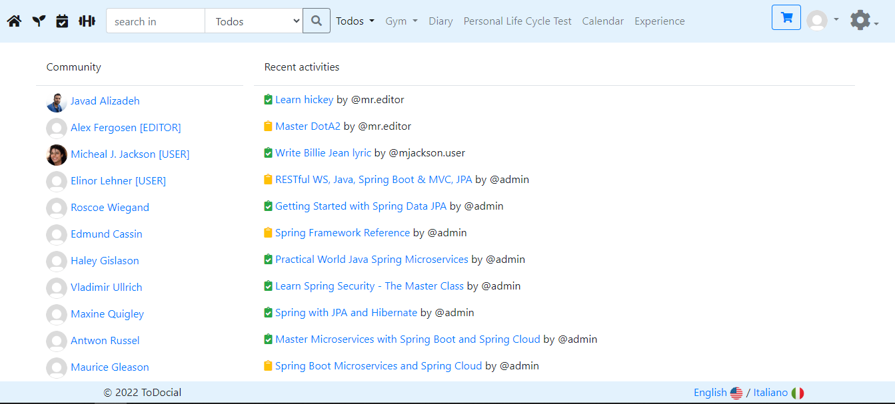

# 3.1. User Login with Valid Credentials

## Objective
Verify that a user can successfully log in with a valid email and password.

## Preconditions
1. The user account is registered and active.
2. The login page is accessible.

## Test Steps
| # | When | Given | Then | Test Data |
| --- | --- | --- | --- | --- |
| 1 | Navigate to login page   http://localhost:8080/login | | Login form is showed | |
| 2 | The user has a registered and active account | Enter a valid email address and password associated with a registered user account | | username: `admin`   password: `12345` |
| 3 | Click on the "Login" button |  | User is logged in successfully | |
| 4 | User is redirected to Home page | User is authenticated and has `admin` grant | Can view all buttons |  |

## Expected Results
- The system should authenticate the user and grant access to the application.
- The user should be redirected to Home page.
- On successful login, user has access to all menu items and can surf the application.

## Postconditions
- The user should have access to their account features.
- Verify the accuracy of the user's displayed information (e.g., username, profile picture).

## Notes
- Confirm that the login process is secure, and the entered password is masked.
- Check for any additional security measures (e.g., two-factor authentication).
- If applicable, test the "Remember Me" functionality.
- Verify the behavior in case of incorrect email or password entries (negative testing).