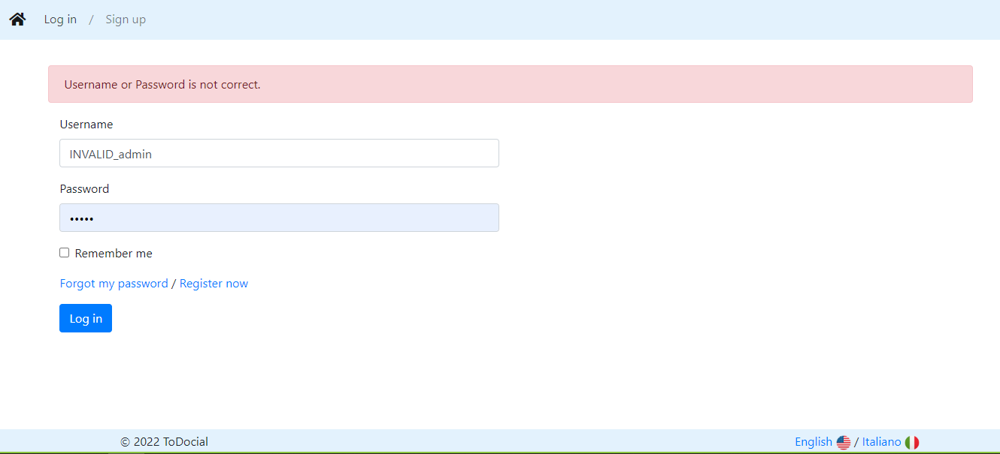

# 3.2. Login Attempt with Invalid Email/Password

## Objective
Verify that the system handles a login attempt appropriately when an invalid email or password is provided.

## Preconditions
1. The user account is registered.
2. The login page is accessible.

## Test Steps
| # | When | Given | Then | Test Data |
| --- | --- | --- | --- | --- |
| 1 | Navigate to login page   http://localhost:8080/login | | Login form is showed | |
| 2 |  | Enter an valid email address with a correct password | | username: `INVALID_admin`   password: `12345` |
| 3 | Click on the "Login" button |  | The error message is shown   *Username or Password is not correct.* | |
| 4 | Refresh page | | | |
| 5 | | Enter a valid email address with an invalid password | | username: `admin`   password: `INVALID_12345` |
| 6 | Click on the "Login" button |  | The error message is shown   *Username or Password is not correct.* | |
| 7 | Refresh page | | | |
| 8 | | Enter invalid username and passowrd | | username: `INVALID_admin`   password: `INVALID_12345` |
| 9 | Click on the "Login" button |  | The error message is shown   *Username or Password is not correct.* | |

## Expected Results
- The system should display an error message indicating the invalid credentials.
- The user should not be granted access to the application.
- The login page should remain open for further attempts.

## Postconditions
- The user account should remain in the same state as before the login attempt.
- No changes should occur in the user's account status or information.

## Notes
- Verify that the error message provides clear guidance on the nature of the error (e.g., "Invalid email address" or "Incorrect password").
- Ensure that the system does not reveal whether the email or password was incorrect to enhance security.
- Confirm that multiple consecutive failed login attempts do not lock the user out of the account (unless such a security measure is intentionally implemented).