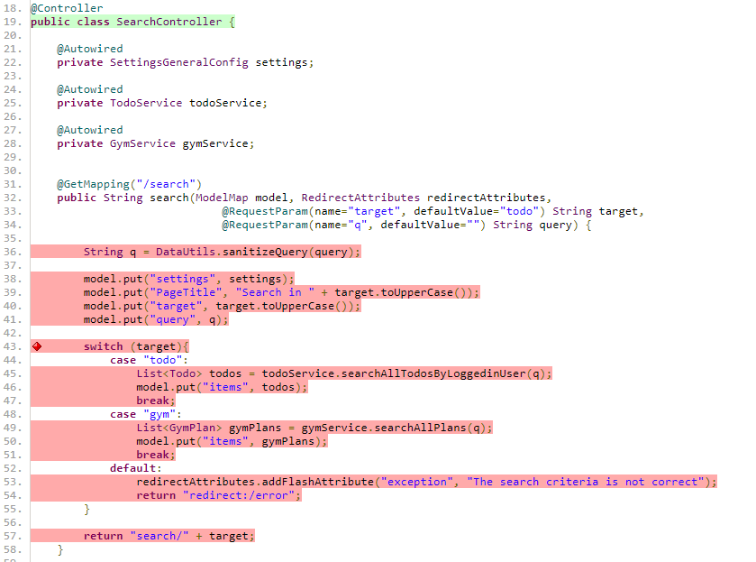
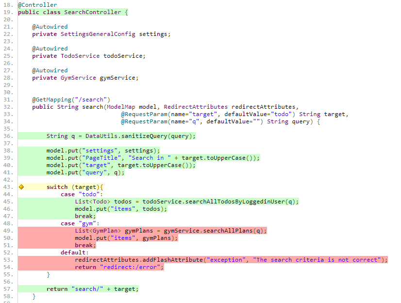

# ToDocial :: Test Documentation

## 1. [Test Planning](Test%20Plan.md)
Activities:
- Define test objectives
- Configuration management

Work products:
- Test plan (items)
- Exit criteria
- Deliverables


## 2. Monitoring & Control
Activities:
- On-going status
- More tests needed?
- Where/when to stop?

Work products:
- Reports (in progress / summary)

## 3. Analysis
Using White-box, Black-box or Exploratory-based techniques

Activities:
- What to test? (analyze test basis)
- Test conditions
- Static testing (to find defects)
- Define and prioritize
- Traceability

Work products:
- Test charters (Exploratory-based)
- Defect reports (found defects)
- Defined and prioritized tests

## 4. Test Design
Using White-box, Black-box or Exploratory-based techniques

Activities:
- How to test? (High-level test cases)
- Design and prioritize
- Test data, environment and tools
- Tracing

Work products:
- High-level test cases  without test input/output
- Defect reports (found defects)


## 5. Implementation
Activities:
- Develop and prioritize
- Verify and update trace
- May refine test case, test requirements or find defects

Work product:
- Test procedure and sequences
- Test suits
- Schedule

## 6. Execution
Activities:
- Execute suites according to schedule

Work product:
- Status document of each test
- Defect reports (found defects)
- Run system/config document
- Coverage criteria

## 7. Completion
Complete and close test activities according to project milestones

Activities:
- Wrap up
- Defects are closed?

Work product:
- Summary report
- Improvements for future tests
- Change requests (CR)
- Product backlog
- Archived/finalized testware
- Analyze lessons

## Tips & Tricks
A good way to figure out test scenarios and their cases, and stay concentrated on them, is following:

1. Run `mvn clean test` which produces *Surefire* and *Jacoco* reports
2. Go to `/target/site/jacoco/index.html` which has full report for test coverage
3. Open the desired class 
    - I suggest to start, pick the smallest classes first
4. Look for red lines or diamonds
    - Red line: uncovered loc
    - Diamond: hover mouse pointer on it and check the test branches (scenarios) you need to consider

Note that in Jacoco report, green line doesn't 100% guaranties that the line is tested.

```
mvn test -Dtest=SearchControllerTest.java
```



The test developed never tests `modelMap`, but only covers 1/3 of test branches.

```java
@Test
void searchTodo_validQuery() throws Exception {
    List<Todo> mockTodos = Arrays.asList(new Todo(), new Todo());
    when(todoService.searchAllTodosByLoggedinUser(any())).thenReturn(mockTodos);

    mvc.perform(get(BASE_URL).param("target", "todo").param("q", VALID_QUERY)
                    .header(HttpHeaders.AUTHORIZATION, "Basic " + Base64Utils.encodeToString("admin:12345".getBytes())))
            .andExpect(MockMvcResultMatchers.status().isOk());
}
```


